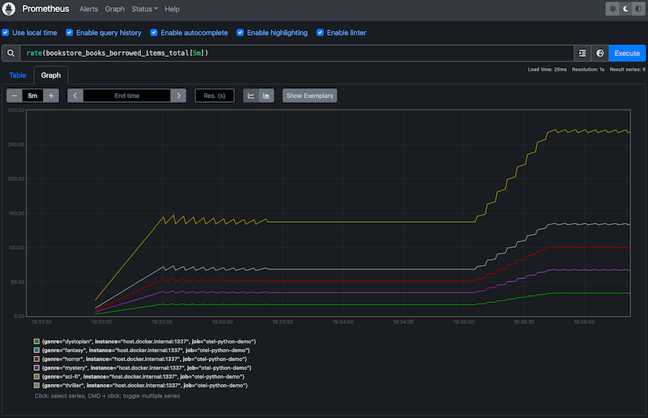

Sanic OpenTelemetry example
===========================

Sanic application uses OpenTelemetry Metrics and exports it directly to
Prometheus.

Issues:

* Does not collect metrics when multiple workers. More info: [Prometheus
  Client: FastAPI + Gunicorn](https://github.com/prometheus/client_python#fastapi--gunicorn).
  
  To use multiple workers set `MULTIPROC=yes` and `--workers=2` when running
  the Sanic server (`make run`).

Development
-----------

Run:

    $ make venv  # one time
    $ make run   

In a separate terminal:

    $ make prom-start
    $ open http://127.0.0.1:9090
    $ make k6
    $ make prom-stop

Linux users: replace in `docker/prometheus.yml`:

    - targets: ['host.docker.internal:1337']

with:

    - targets: ['127.0.0.1:1337']

Result:

